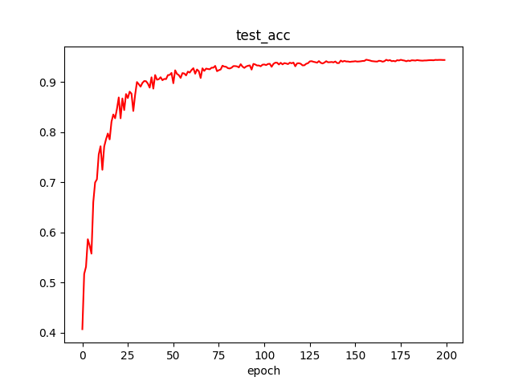
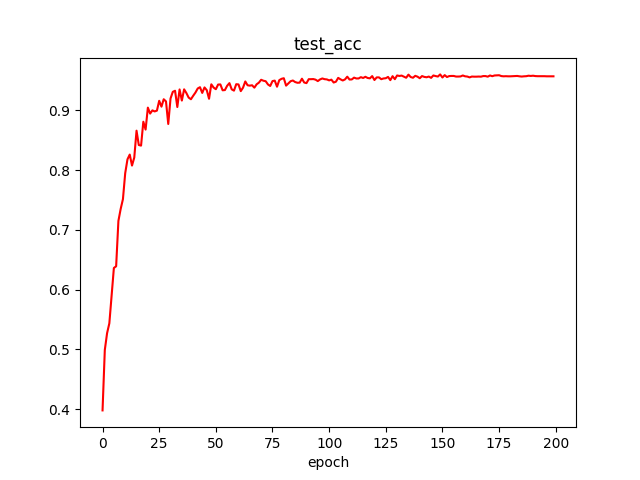
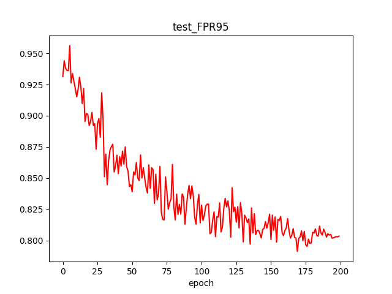
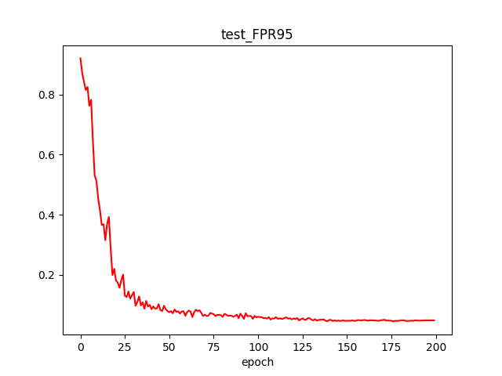
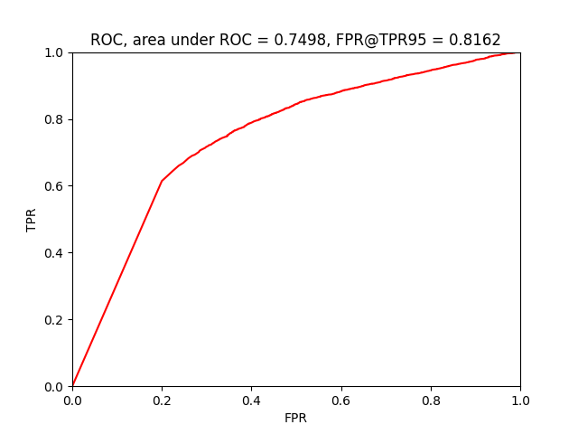
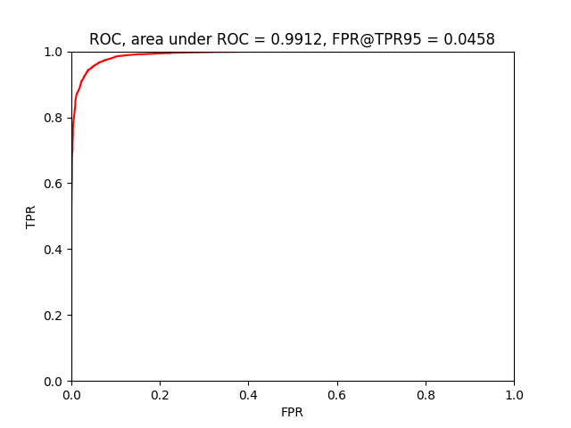

# Energy-based Out-of-Distribution Detection

This is an **unofficial** PyTorch implementation of NIPS2020-paper: 

[Energy-based Out-of-distribution Detection (Liu et al, 2020)](https://proceedings.neurips.cc/paper/2020/file/f5496252609c43eb8a3d147ab9b9c006-Paper.pdf)

**Import Note**

I am not one of authors of this paper. This is only a private practice for the educational and academic purposes and it's highly recommended that you can refer to the authors' official source codes in this [repo](https://github.com/wetliu/energy_ood).

---------------------------------------------------------------------------
## Dependencies

* PyTorch
* torchvision
* numpy
* tqdm
* opencv-python
* imageio
* matplotlib


---------------------------------------------------------------------------
## Preliminary and Background

To better understand the proposed method in Energy-based OOD detection, there are some background references introducing that how a discriminative model (e.g., a neural network with softmax activation in final layer) can be regarded as an Energy-based Model.

1. [Ref. 1 - Blog Post](https://jmtomczak.github.io/blog/11/11_energy_based_models.html)
2. [Ref. 2 - ICLR 2020 paper (Grathwohl et al, 2020)](https://arxiv.org/pdf/1912.03263)

Following the derivation in the ref. above, readers can realize that, by manipulating the logits fed into the softmax activation, you can get the "minus energy" term in Energy-based Models (EBMs).

To get a step further, this "manipulation" just reveals that how an EBM is hidden in your discriminative model and why the softmax function can get the posterior probability $P(y|x)$.

With this connection between discriminative models and EBMs, one can further train this EBM by using the training tricks for generative modeling (e.g., use SGLD or other MCMCs to make sampling). However, if we go any further in this direction, the content will drift off topic, therefore, the remaining sections on EBM training can be reffered to in Ref. 2.

---------------------------------------------------------------------------
## Proposed Method - Energy OOD

The proposed method in Energy OOD detction mathematically proves that, the derived "minus energy" term is more suitable than the commonly used Softmax Score.

The key observation is, the existence of intractable normalization term, $Z$, will not affect the judgement for OOD detection. In this way, we can ignore $Z$ and simply consider the minus energy term as the metric to determine whether this sample is in- or out-of-distribution.

Following this insight, Energy OOD detection further proposes the energy hinge loss to separate apart the distribution of energy values of inliers/outliers, to improve the performance.

With Energy OOD, one can insert it into any discriminative model to achieve a more durable outlier-rejected property in general, and the experimental results show that this approach will not hinder the training for original purpose (e.g., classification for inliers).

**Import Clarification.** It doesn't say that we need to estimate and use the normalization term for OOD detection purpose. Actually we are not going to train an EBM, instead, we just leverage the numerator term of $P(x) = \dfrac{\hat{P}(x)}{Z} = \dfrac{e^{-E(x)}}{Z}$, where $Z = \int_{}^{} e^{-E(x)} dx$. Thus, there is no need to use sampling method (like SGLD) for estimating the gradient of term $Z$ w.r.t model parameters.

The remaining details can be refferd to in the paper.

---------------------------------------------------------------------------
## Training and Testing

The script `main.py` is the common entrance for the experiments.

You can simply run the normal training without any OOD detection method, as the baseline, with this command:

```markdown
python main.py --mode baseline_train --gpu 0
```

On the other hand, you can also run the training for Energy OOD detection, such as:

```markdown
python main.py --mode energy_train --gpu 0
```

The default training setting has already been tuned by myself, so the convergence of training with it should be fine.

You still can type `python main.py --help` or check `main.py` to adjust corresponging arguments.

```
optional arguments:
  --help          
  --mode MODE                   MODE is either baseline_train or energy_train
  --gpu 0       
  --lr 0.01          
  --batch_size 128   
  --optimizer sgd
  --lamda 0.05                  Coefficient of energy hinge loss term
  --ood_threshold 10            Energy threshold for inference 
  --energy_inlier_margin -15    Used in energy hinge loss
  --energy_outlier_margin -5    Used in energy hinge loss
```

Note: You can use Tensorboard to track the training process.

---------------------------------------------------------------------------
## Results

The definition of such out-of-distribution samples only depends on how we want to define and build our deep learning task.
Here, in convenience, we only use CIFAR10 dataset in our whole experiments, specifically, we use the first 5 classes in CIFAR10 as our normal and desired in-distribution data and build a classification model. Besides, data with resting 5 classes are treated as OOD data.

The following tables and figures are the results coming from the `main.py` above.

| Method | Inlier Accuracy| Outlier FPR@TPR95%|AUROC|
| ---------- |----------      |-----------        |---- |
| Baseline|94.5%|81.62%|74.98%
| Energy OOD|96.0%|4.58%|99.12%|


#### Testing Inlier Accuracy in the training process

| Baseline| Energy OOD|
| ---------- |----------|
| ||


#### Testing Outlier FPR95 in the training process

| Baseline| Energy OOD|
| ---------- |----------|
| ||

#### Test ROC curve

| Baseline| Energy OOD|
| ---------- |----------|
| ||

As shown above, we can see that Energy OOD achieves results that are better than baseline in terms of FPR95 and AUROC, while maintaining the same level of the accuracy.

It reveals that we can use Energy OOD to get the ability to reject outlier for any discriminative model without degrading the performance of original purpose.

